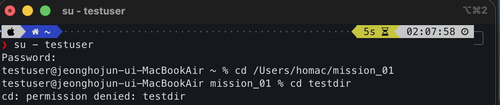

## 1) 실행 환경


## 2) 수행 체크리스트
1. [x] 터미널 기본 조작 및 폴더 구성
2. [x] 권한 변경 실습
3. [] Docker 설치/점검
4. [] hello-world 실행
5. [] Dockerfile 빌드/실행
6. [] 포트 매핑 접속(2회)
7. [] 바인드 마운트 반영
8. [] 볼륨 영속성
9. [] Git 설정 + VSCode GitHub 연동

 ## 3) 수행 로그(발췌)

### 1. 터미널 기본 조작 및 폴더 구성
```bash
milky99259753@c5r2s3 ~ % pwd # 현재 절대 경로 확인
/Users/milky99259753

milky99259753@c5r2s3 ~ % ls # 목록 조회
cod_beg_01	Documents	Library		Music		Pictures
Desktop		Downloads	Movies		OrbStack	Public

milky99259753@c5r2s3 ~ % ls -a # 숨겨진 목록도 표시
.			.viminfo		Downloads
..			.vscode			Library
.CFUserTextEncoding	.zsh_history		Movies
.docker			.zsh_sessions		Music
.orbstack		cod_beg_01		OrbStack
.ssh			Desktop			Pictures
.Trash			Documents		Public

milky99259753@c5r2s3 ~ % mkdir mission_01 # mission_01 디렉토리 생성

milky99259753@c5r2s3 ~ % cd mission_01  # mission_01 디렉토리로 이동

milky99259753@c5r2s3 mission_01 % pwd # 위치 재확인
/Users/milky99259753/mission_01

milky99259753@c5r2s3 mission_01 % touch test.txt # test.txt 파일 생성

milky99259753@c5r2s3 mission_01 % ls # 생성됐는지 확인
test.txt

milky99259753@c5r2s3 mission_01 % echo "hi codyssey" > test.txt # test.txt 파일 안에 "hi codyssey" 텍스트 작성
milky99259753@c5r2s3 mission_01 % cat test.txt # 파일 조회
hi codyssey # 정상적으로 출력됨

### 여기서부터 로컬로 진행 ###

    ~/mission_01 ····················································· 10:35:19  
❯ cat test.txt                                                                         
hi codyssey 
    ~/mission_01 ····················································· 10:35:24  
❯ cp test.txt test_copy.txt # 파일 복사                                                
    ~/mission_01 ····················································· 10:35:52  
❯ ls                                                                                   
test_copy.txt test.txt # 복사된 파일 확인
    ~/mission_01 ····················································· 10:35:54  
❯ mv test_copy.txt newname.txt # 파일 이름 변경                                        
    ~/mission_01 ····················································· 10:36:34  
❯ ls                                                                                   
newname.txt test.txt # 변경된 파일 이름 확인
    ~/mission_01 ····················································· 10:36:35  
❯ mkdir backup # 디렉토리 생성                                                         
    ~/mission_01 ····················································· 10:37:02  
❯ mv newname.txt backup # newname.txt 파일을 생성한 디렉토리로 이동                    
    ~/mission_01 ····················································· 10:37:21  
❯ ls                                                                                   
backup   test.txt # 목록 확인
    ~/mission_01 ····················································· 10:37:22  
❯ ls backup                                                                            
newname.txt # `backup`디렉토리 목록 확인
    ~/mission_01 ····················································· 10:37:30  
❯ rmdir backup # 디렉토리 삭제                                                         
rmdir: backup: Directory not empty # 디렉토리가 비워지지 않아 삭제 X
    ~/mission_01 ····················································· 10:38:02  
❯ cd backup # 디렉토리 진입                                                            
    ~/mission_01/backup ·············································· 10:38:16  
❯ rm newname.txt # 파일 먼저 삭제                                                      
    ~/mission_01/backup ·············································· 10:38:22  
❯ cd ..                                                                                
    ~/mission_01 ····················································· 10:38:26  
❯ rmdir backup # 빈 디렉토리 삭제                                                      
    ~/mission_01 ····················································· 10:48:34  
❯ ls                                                                                   
test.txt # 삭제 확인

### 절대 경로와 상대 경로 ###
    ~/mission_01 ···················································· 00:33:14  
❯ pwd # 절대 경로 조회                                                                
/Users/homac/mission_01
    ~/mission_01 ···················································· 00:33:14  
❯ ls # 현재 디렉토리 내부 목록 확인                                                   
test.txt
    ~/mission_01 ···················································· 00:33:18  
❯ cat test.txt # 단순 조회                                                            
hi codyssey
    ~/mission_01 ···················································· 00:33:27  
❯ cat ./test.txt # 상대 경로로 조회                                                   
hi codyssey
    ~/mission_01 ···················································· 00:33:33  
❯ cat /Users/homac/mission_01/test.txt # 절대 경로로 조회                             
hi codyssey

# 절대 경로는 루트(Users)부터 시작하는 전체 주소이고, 상대경로는 현재 위치를 기준으로 한 주소이다. 
# 같은 파일이라도 현재 위치에 따라 상대경로 표현은 달라지지만, 절대경로는 불변한다. 
```
---

### 절대 경로와 상대 경로
```bash
### 절대 경로와 상대 경로 ###
    ~/mission_01 ···················································· 00:33:14  
❯ pwd # 절대 경로 조회                                                                
/Users/homac/mission_01
    ~/mission_01 ···················································· 00:33:14  
❯ ls # 현재 디렉토리 내부 목록 확인                                                   
test.txt
    ~/mission_01 ···················································· 00:33:18  
❯ cat test.txt # 단순 조회                                                            
hi codyssey
    ~/mission_01 ···················································· 00:33:27  
❯ cat ./test.txt # 상대 경로로 조회                                                   
hi codyssey
    ~/mission_01 ···················································· 00:33:33  
❯ cat /Users/homac/mission_01/test.txt # 절대 경로로 조회                             
hi codyssey
```

`절대 경로`는 루트(Users)부터 시작하는 전체 주소이고, `상대 경로`는 현재 위치를 기준으로 한 주소이다.  
위 로그로 알 수 있듯, 같은 파일이라도 현재 위치에 따라 상대경로 표현은 달라지지만, 절대경로는 불변한다. 

---

### 2. 권한 실습
파일 권한은 소유자(owner), 그룹(group), 기타 사용자(others) 기준으로 구분된다.  
각 권한은 읽기(r), 쓰기(w), 실행(x)으로 표현되며, 숫자로는 r=4, w=2, x=1로 계산한다.  
`ls -l` 명령어 입력 시, 
목록의 각 파일 앞단에 `-rw-r--r--` 같은 로그가 표시되는데,  
해석하자면 `- | rw- | r-- | r--` 로 끊어서   
`파일 타입 | 소유자 권한 | 그룹 권한 | 기타 사용자 권한`이 되는거다.  
즉 각 사용자에 대해 `파일(디렉토리 아님) | 읽기, 쓰기 | 읽기 | 읽기` 의 권한이 있다는거.

그걸 더 간단히 표현하기 위해 `r=4, w=2, x=1` 이라는 숫자를 할당해, 각 칸에 권한의 합을 넣어 표현하는거다. 
 `644`는 `rw-r--r--`로, 소유자는 읽기/쓰기 가능하고 그룹과 기타 사용자는 읽기만 가능하다는 뜻이다.  
`755`는 `rwxr-xr-x`로, 소유자는 모든 권한을 가지며 그룹과 기타 사용자는 읽기 및 실행 권한을 가진다.

특히 디렉토리에서 실행 권한(x)은 해당 디렉토리에 진입할 수 있는 권한을 의미한다.

### 로그 예시

1) 권한 조회
```bash
    ~/mission_01 ···················································· 01:32:02  
❯ ls      
test.txt
    ~/mission_01 ···················································· 01:32:37  
❯ ls -l test.txt                                                   
-rw-r--r--@ 1 homac  staff  12  3월 31 10:35 test.txt # test.txt는 644다
    ~/mission_01 ···················································· 01:32:41  
❯ mkdir testdir # 테스트용 디렉토리 생성                                                          
    ~/mission_01 ···················································· 01:33:10  
❯ ls -l                                                                               
total 8
-rw-r--r--@ 1 homac  staff  12  3월 31 10:35 test.txt
drwxr-xr-x@ 2 homac  staff  64  4월  1 01:33 testdir # 디렉토리라서 맨앞 d로 표시됨. 755인 거 확인 가능.

# 파일은 644, 디렉토리는 755의 권한 기본값을 가지고 있는 걸 확인했다.
```
---  
2) 권한 변경
```bash
# 파일 권한 644 -> 600으로 변환해보기
    ~/mission_01 ···················································· 01:33:13  
❯ chmod 600 test.txt # 600으로 권한 변경                                                                    
    ~/mission_01 ···················································· 01:42:46  
❯ ls -l test.txt                                                                     
total 8
-rw-------@ 1 homac  staff  12  3월 31 10:35 test.txt # 정상적으로 변경됨. 

# 디렉토리 권한 755 -> 700으로 변경해보기
    ~/mission_01 ···················································· 01:42:50  
❯ chmod 700 testdir                                                                   
    ~/mission_01 ···················································· 01:45:08  
❯ ls -l testdir # 이렇게 명령하면 testdir 안의 파일들 권한이 조회돼버림                                                                     
total 0
    ~/mission_01 ···················································· 01:45:20  
❯ ls -ld testdir # 단일 디렉토리 권한 조회할 땐 -ld 사용                                                                  
drwx------@ 2 homac  staff  64  4월  1 01:33 testdir # 정상적으로 변경됨
```
---
3) 검증  
검증을 위해 테스트용 사용자 계정`testuser`를 만들고 새 터미널에서 진행했다.

600으로 권한을 변경한 `/Users/homac/mission_01/test.txt` 를 조회한 결과,  
`Permission denied`가 나온다!


디렉토리도 700으로 설정했기 때문에 `Permission denied`가 나오는 모습.

