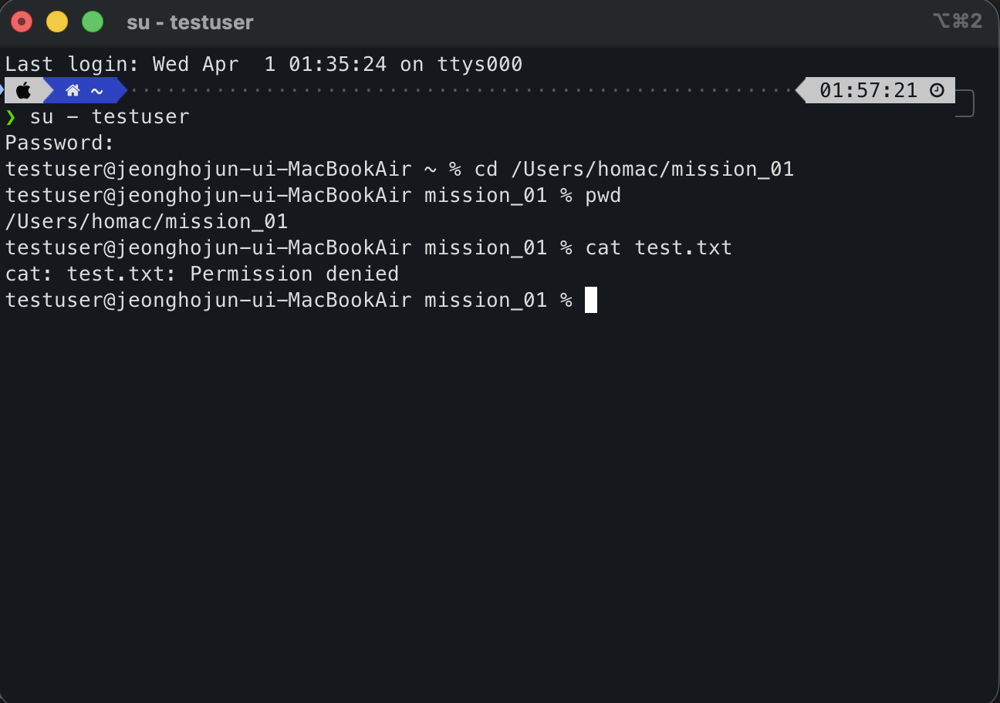
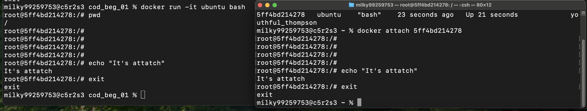
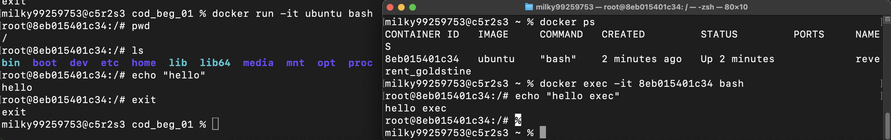

## 개요
터미널, Docker, Git을 활용하여
재현 가능한 개발 워크스테이션을 구축하는 것을 목표로 한다.

## 1) 실행 환경
- OS: macOS
- Shell: zsh
- Terminal: 기본 macOS Terminal
- Docker: 28.5.2
- Container Runtime: OrbStack
- Git: version 2.53.0

## 2) 수행 체크리스트
1. [x] 터미널 기본 조작 및 폴더 구성
2. [x] 권한 변경 실습
3. [x] Docker 설치/점검
4. [x] hello-world 실행
5. [x] Dockerfile 빌드/실행
6. [x] 포트 매핑 접속(2회)
7. [x] 바인드 마운트 반영
8. [x] 볼륨 영속성
9. [x] Git 설정 + VSCode/GitHub 연동

 ## 3) 수행 로그(발췌)

### 1. 터미널 기본 조작 및 폴더 구성
```bash
milky99259753@c5r2s3 ~ % pwd # 현재 절대 경로 확인
/Users/milky99259753

milky99259753@c5r2s3 ~ % ls # 목록 조회
cod_beg_01	Documents	Library		Music		Pictures
Desktop		Downloads	Movies		OrbStack	Public

milky99259753@c5r2s3 ~ % ls -a # 숨겨진 목록도 표시
.			.viminfo		Downloads
..			.vscode			Library
.CFUserTextEncoding	.zsh_history		Movies
.docker			.zsh_sessions		Music
.orbstack		cod_beg_01		OrbStack
.ssh			Desktop			Pictures
.Trash			Documents		Public

milky99259753@c5r2s3 ~ % mkdir mission_01 # mission_01 디렉토리 생성

milky99259753@c5r2s3 ~ % cd mission_01  # mission_01 디렉토리로 이동

milky99259753@c5r2s3 mission_01 % pwd # 위치 재확인
/Users/milky99259753/mission_01

milky99259753@c5r2s3 mission_01 % touch test.txt # test.txt 파일 생성

milky99259753@c5r2s3 mission_01 % ls # 생성됐는지 확인
test.txt

milky99259753@c5r2s3 mission_01 % echo "hi codyssey" > test.txt # test.txt 파일 안에 "hi codyssey" 텍스트 작성
milky99259753@c5r2s3 mission_01 % cat test.txt # 파일 조회
hi codyssey # 정상적으로 출력됨

### 여기서부터 로컬로 진행 ###

    ~/mission_01 ····················································· 10:35:19  
❯ cat test.txt                                                                         
hi codyssey 
    ~/mission_01 ····················································· 10:35:24  
❯ cp test.txt test_copy.txt # 파일 복사                                                
    ~/mission_01 ····················································· 10:35:52  
❯ ls                                                                                   
test_copy.txt test.txt # 복사된 파일 확인
    ~/mission_01 ····················································· 10:35:54  
❯ mv test_copy.txt newname.txt # 파일 이름 변경                                        
    ~/mission_01 ····················································· 10:36:34  
❯ ls                                                                                   
newname.txt test.txt # 변경된 파일 이름 확인
    ~/mission_01 ····················································· 10:36:35  
❯ mkdir backup # 디렉토리 생성                                                         
    ~/mission_01 ····················································· 10:37:02  
❯ mv newname.txt backup # newname.txt 파일을 생성한 디렉토리로 이동                    
    ~/mission_01 ····················································· 10:37:21  
❯ ls                                                                                   
backup   test.txt # 목록 확인
    ~/mission_01 ····················································· 10:37:22  
❯ ls backup                                                                            
newname.txt # `backup`디렉토리 목록 확인
    ~/mission_01 ····················································· 10:37:30  
❯ rmdir backup # 디렉토리 삭제                                                         
rmdir: backup: Directory not empty # 디렉토리가 비워지지 않아 삭제 X
    ~/mission_01 ····················································· 10:38:02  
❯ cd backup # 디렉토리 진입                                                            
    ~/mission_01/backup ·············································· 10:38:16  
❯ rm newname.txt # 파일 먼저 삭제                                                      
    ~/mission_01/backup ·············································· 10:38:22  
❯ cd ..                                                                                
    ~/mission_01 ····················································· 10:38:26  
❯ rmdir backup # 빈 디렉토리 삭제                                                      
    ~/mission_01 ····················································· 10:48:34  
❯ ls                                                                                   
test.txt # 삭제 확인

### 절대 경로와 상대 경로 ###
    ~/mission_01 ···················································· 00:33:14  
❯ pwd # 절대 경로 조회                                                                
/Users/homac/mission_01
    ~/mission_01 ···················································· 00:33:14  
❯ ls # 현재 디렉토리 내부 목록 확인                                                   
test.txt
    ~/mission_01 ···················································· 00:33:18  
❯ cat test.txt # 단순 조회                                                            
hi codyssey
    ~/mission_01 ···················································· 00:33:27  
❯ cat ./test.txt # 상대 경로로 조회                                                   
hi codyssey
    ~/mission_01 ···················································· 00:33:33  
❯ cat /Users/homac/mission_01/test.txt # 절대 경로로 조회                             
hi codyssey

# 절대 경로는 루트(Users)부터 시작하는 전체 주소이고, 상대경로는 현재 위치를 기준으로 한 주소이다. 
# 같은 파일이라도 현재 위치에 따라 상대경로 표현은 달라지지만, 절대경로는 불변한다. 
```
---

### 절대 경로와 상대 경로
```bash
### 절대 경로와 상대 경로 ###
    ~/mission_01 ···················································· 00:33:14  
❯ pwd # 절대 경로 조회                                                                
/Users/homac/mission_01
    ~/mission_01 ···················································· 00:33:14  
❯ ls # 현재 디렉토리 내부 목록 확인                                                   
test.txt
    ~/mission_01 ···················································· 00:33:18  
❯ cat test.txt # 단순 조회                                                            
hi codyssey
    ~/mission_01 ···················································· 00:33:27  
❯ cat ./test.txt # 상대 경로로 조회                                                   
hi codyssey
    ~/mission_01 ···················································· 00:33:33  
❯ cat /Users/homac/mission_01/test.txt # 절대 경로로 조회                             
hi codyssey
```

`절대 경로`는 루트(Users)부터 시작하는 전체 주소이고, `상대 경로`는 현재 위치를 기준으로 한 주소이다.  
위 로그로 알 수 있듯, 같은 파일이라도 현재 위치에 따라 상대경로 표현은 달라지지만, 절대경로는 불변한다. 

---

### 2. 권한 실습
파일 권한은 소유자(owner), 그룹(group), 기타 사용자(others) 기준으로 구분된다.  
각 권한은 읽기(r), 쓰기(w), 실행(x)으로 표현되며, 숫자로는 r=4, w=2, x=1로 계산한다.  
`ls -l` 명령어 입력 시, 
목록의 각 파일 앞단에 `-rw-r--r--` 같은 로그가 표시되는데,  
해석하자면 `- | rw- | r-- | r--` 로 끊어서   
`파일 타입 | 소유자 권한 | 그룹 권한 | 기타 사용자 권한`이 되는거다.  
즉 각 사용자에 대해 `파일(디렉토리 아님) | 읽기, 쓰기 | 읽기 | 읽기` 의 권한이 있다는거.

그걸 더 간단히 표현하기 위해 `r=4, w=2, x=1` 이라는 숫자를 할당해, 각 칸에 권한의 합을 넣어 표현하는거다. 
 `644`는 `rw-r--r--`로, 소유자는 읽기/쓰기 가능하고 그룹과 기타 사용자는 읽기만 가능하다는 뜻이다.  
`755`는 `rwxr-xr-x`로, 소유자는 모든 권한을 가지며 그룹과 기타 사용자는 읽기 및 실행 권한을 가진다.

특히 디렉토리에서 실행 권한(x)은 해당 디렉토리에 진입할 수 있는 권한을 의미한다.

### 로그 예시

1) 권한 조회
```bash
    ~/mission_01 ···················································· 01:32:02  
❯ ls      
test.txt
    ~/mission_01 ···················································· 01:32:37  
❯ ls -l test.txt                                                   
-rw-r--r--@ 1 homac  staff  12  3월 31 10:35 test.txt # test.txt는 644다
    ~/mission_01 ···················································· 01:32:41  
❯ mkdir testdir # 테스트용 디렉토리 생성                                                          
    ~/mission_01 ···················································· 01:33:10  
❯ ls -l                                                                               
total 8
-rw-r--r--@ 1 homac  staff  12  3월 31 10:35 test.txt
drwxr-xr-x@ 2 homac  staff  64  4월  1 01:33 testdir # 디렉토리라서 맨앞 d로 표시됨. 755인 거 확인 가능.

# 파일은 644, 디렉토리는 755의 권한 기본값을 가지고 있는 걸 확인했다.
```
---  
2) 권한 변경
```bash
# 파일 권한 644 -> 600으로 변환해보기
    ~/mission_01 ···················································· 01:33:13  
❯ chmod 600 test.txt # 600으로 권한 변경                                                                    
    ~/mission_01 ···················································· 01:42:46  
❯ ls -l test.txt                                                                     
total 8
-rw-------@ 1 homac  staff  12  3월 31 10:35 test.txt # 정상적으로 변경됨. 

# 디렉토리 권한 755 -> 700으로 변경해보기
    ~/mission_01 ···················································· 01:42:50  
❯ chmod 700 testdir                                                                   
    ~/mission_01 ···················································· 01:45:08  
❯ ls -l testdir # 이렇게 명령하면 testdir 안의 파일들 권한이 조회돼버림                                                                     
total 0
    ~/mission_01 ···················································· 01:45:20  
❯ ls -ld testdir # 단일 디렉토리 권한 조회할 땐 -ld 사용                                                                  
drwx------@ 2 homac  staff  64  4월  1 01:33 testdir # 정상적으로 변경됨
```
---
3) 검증  
검증을 위해 테스트용 사용자 계정`testuser`를 만들고 새 터미널에서 진행했다.  

600으로 권한을 변경한 `/Users/homac/mission_01/test.txt` 를 조회한 결과,  
`Permission denied`가 나온다!

디렉토리도 700으로 설정했기 때문에 `Permission denied`가 나오는 모습.

## 3. Docker 설치 및 기본 점검
```bash
milky99259753@c5r2s3 cod_beg_01 % docker --version # Docker 설치 확인
Docker version 28.5.2, build ecc6942

milky99259753@c5r2s3 cod_beg_01 % docker info # Docker 데몬(엔진)이 실제로 떠 있는지 확인
Client:
 Version:    28.5.2
 Context:    orbstack
 Debug Mode: false
 Plugins:
  buildx: Docker Buildx (Docker Inc.)
    Version:  v0.29.1
    Path:     /Users/milky99259753/.docker/cli-plugins/docker-buildx
  compose: Docker Compose (Docker Inc.)
    Version:  v2.40.3
    Path:     /Users/milky99259753/.docker/cli-plugins/docker-compose

Server:
 Containers: 2
  Running: 0
  Paused: 0
  Stopped: 2
 Images: 2
 Server Version: 28.5.2
 Storage Driver: overlay2
  Backing Filesystem: btrfs
  Supports d_type: true
  Using metacopy: false
  Native Overlay Diff: true
  userxattr: false
 Logging Driver: json-file
 Cgroup Driver: cgroupfs
 Cgroup Version: 2
 Plugins:
  Volume: local
  Network: bridge host ipvlan macvlan null overlay
  Log: awslogs fluentd gcplogs gelf journald json-file local splunk syslog
 CDI spec directories:
  /etc/cdi
  /var/run/cdi
 Swarm: inactive
 Runtimes: io.containerd.runc.v2 runc
 Default Runtime: runc
 Init Binary: docker-init
 containerd version: 1c4457e00facac03ce1d75f7b6777a7a851e5c41
 runc version: d842d7719497cc3b774fd71620278ac9e17710e0
 init version: de40ad0
 Security Options:
  seccomp
   Profile: builtin
  cgroupns
 Kernel Version: 6.17.8-orbstack-00308-g8f9c941121b1
 Operating System: OrbStack
 OSType: linux
 Architecture: x86_64
 CPUs: 6
 Total Memory: 15.67GiB
 Name: orbstack
 ID: 91594213-c850-4ee8-8459-f5d3f3b0b153
 Docker Root Dir: /var/lib/docker
 Debug Mode: false
 Experimental: false
 Insecure Registries:
  ::1/128
  127.0.0.0/8
 Live Restore Enabled: false
 Product License: Community Engine
 Default Address Pools:
   Base: 192.168.97.0/24, Size: 24
   Base: 192.168.107.0/24, Size: 24
   Base: 192.168.117.0/24, Size: 24
   Base: 192.168.147.0/24, Size: 24
   Base: 192.168.148.0/24, Size: 24
   Base: 192.168.155.0/24, Size: 24
   Base: 192.168.156.0/24, Size: 24
   Base: 192.168.158.0/24, Size: 24
   Base: 192.168.163.0/24, Size: 24
   Base: 192.168.164.0/24, Size: 24
   Base: 192.168.165.0/24, Size: 24
   Base: 192.168.166.0/24, Size: 24
   Base: 192.168.167.0/24, Size: 24
   Base: 192.168.171.0/24, Size: 24
   Base: 192.168.172.0/24, Size: 24
   Base: 192.168.181.0/24, Size: 24
   Base: 192.168.183.0/24, Size: 24
   Base: 192.168.186.0/24, Size: 24
   Base: 192.168.207.0/24, Size: 24
   Base: 192.168.214.0/24, Size: 24
   Base: 192.168.215.0/24, Size: 24
   Base: 192.168.216.0/24, Size: 24
   Base: 192.168.223.0/24, Size: 24
   Base: 192.168.227.0/24, Size: 24
   Base: 192.168.228.0/24, Size: 24
   Base: 192.168.229.0/24, Size: 24
   Base: 192.168.237.0/24, Size: 24
   Base: 192.168.239.0/24, Size: 24
   Base: 192.168.242.0/24, Size: 24
   Base: 192.168.247.0/24, Size: 24
   Base: fd07:b51a:cc66:d000::/56, Size: 64

WARNING: DOCKER_INSECURE_NO_IPTABLES_RAW is set
```
기존 nginx 이미지를 재사용하여 웹 서버를 직접 구축하지 않고,
정적 콘텐츠만 교체하는 방식으로 빠르게 커스터마이징을 수행했다.

---
### 4. Docker 기본 운영 명령 수행
```bash
milky99259753@c5r2s3 cod_beg_01 % docker images # 현재 로컬에 저장된 Docker 이미지 목록
REPOSITORY   TAG       IMAGE ID   CREATED   SIZE

milky99259753@c5r2s3 cod_beg_01 % docker ps # 실행중인 컨테이너 목록
CONTAINER ID   IMAGE     COMMAND   CREATED   STATUS    PORTS     NAMES
milky99259753@c5r2s3 cod_beg_01 % docker ps -a # 모든(실행중/종료된) 컨테이너 목록
CONTAINER ID   IMAGE          COMMAND       CREATED        STATUS                    PORTS     NAMES
25b2a60dfe77   f794f40ddfff   "/bin/bash"   46 hours ago   Exited (0) 46 hours ago             zen_nash
371bc7285b10   e2ac70e7319a   "/hello"      46 hours ago   Exited (0) 46 hours ago             optimistic_wilson

milky99259753@c5r2s3 cod_beg_01 % docker stats --no-stream # 리소스 확인(컨테이너 CPU/메모리 사용량 확인 가능)
CONTAINER ID   NAME      CPU %     MEM USAGE / LIMIT   MEM %     NET I/O   BLOCK I/O   PIDS
```
---

### 5. Docker 컨테이너 실행 실습

1) hello-world 실행하기
```bash
milky99259753@c5r2s3 cod_beg_01 % docker run hello-world # Docker 컨테이너 실행

Unable to find image 'hello-world:latest' locally 
latest: Pulling from library/hello-world # local에 존재하지 않아 땡겨옴
4f55086f7dd0: Pull complete 
Digest: sha256:452a468a4bf985040037cb6d5392410206e47db9bf5b7278d281f94d1c2d0931
Status: Downloaded newer image for hello-world:latest

Hello from Docker!
This message shows that your installation appears to be working correctly.

To generate this message, Docker took the following steps:
 1. The Docker client contacted the Docker daemon.
 2. The Docker daemon pulled the "hello-world" image from the Docker Hub.
    (amd64)
 3. The Docker daemon created a new container from that image which runs the
    executable that produces the output you are currently reading.
 4. The Docker daemon streamed that output to the Docker client, which sent it
    to your terminal.

To try something more ambitious, you can run an Ubuntu container with:
 $ docker run -it ubuntu bash

Share images, automate workflows, and more with a free Docker ID:
 https://hub.docker.com/

For more examples and ideas, visit:
 https://docs.docker.com/get-started/

milky99259753@c5r2s3 cod_beg_01 % docker ps -a # (바로 종로됐지만) 실행 된 모습
CONTAINER ID   IMAGE         COMMAND    CREATED          STATUS                      PORTS     NAMES
b70553be49f8   hello-world   "/hello"   50 seconds ago   Exited (0) 49 seconds ago             silly_kepler

milky99259753@c5r2s3 cod_beg_01 % docker images # image 조회
REPOSITORY    TAG       IMAGE ID       CREATED      SIZE
hello-world   latest    e2ac70e7319a   8 days ago   10.1kB
```
---
2) ubuntu 실행, 내부 진입 후 명령어 입력해보기
```bash
milky99259753@c5r2s3 cod_beg_01 % docker run -it ubuntu bash # ubuntu 실행
Unable to find image 'ubuntu:latest' locally
latest: Pulling from library/ubuntu
817807f3c64e: Pull complete # local에 존재하지 않아 땡겨옴
Digest: sha256:186072bba1b2f436cbb91ef2567abca677337cfc786c86e107d25b7072feef0c
Status: Downloaded newer image for ubuntu:latest

root@b6baa04e3741:/# pwd # 절대경로 확인
/

root@b6baa04e3741:/# ls # 목록 확인
bin  boot  dev  etc  home  lib  lib64  media  mnt  opt  proc  root  run  sbin  srv  sys  tmp  usr  var

root@b6baa04e3741:/# echo "hello docker" # echo 실행해보기
hello docker

root@b6baa04e3741:/# cat /etc/os-release  
PRETTY_NAME="Ubuntu 24.04.4 LTS"
NAME="Ubuntu"
VERSION_ID="24.04"
VERSION="24.04.4 LTS (Noble Numbat)"
VERSION_CODENAME=noble
ID=ubuntu
ID_LIKE=debian
HOME_URL="https://www.ubuntu.com/"
SUPPORT_URL="https://help.ubuntu.com/"
BUG_REPORT_URL="https://bugs.launchpad.net/ubuntu/"
PRIVACY_POLICY_URL="https://www.ubuntu.com/legal/terms-and-policies/privacy-policy"
UBUNTU_CODENAME=noble
LOGO=ubuntu-logo
root@b6baa04e3741:/# exit
exit
```

#### 확인 내용:  
컨테이너 내부는 독립된 Linux 환경  
호스트와 분리된 파일 시스템 확인

---

3. `attatch` 와 `exec` 의 차이점 알아보기

- attatch

컨테이너 실행 후, 다른 터미널로 attatch를 통해 진입하니 두 터미널이 실시간으로 동기화됨

- exec

컨테이너 실행 후, 이번엔 다른 터미널에서 exec를 통해 진입하니 서로 개별적으로 움직일 수 있는 모습. 그러나 컨테이너를 종료하니 exec로 접속한 터미널에서도 종료됨.

**확인 내용 :** 
- attach는 기존 프로세스에 붙는 방식
- exec는 새로운 프로세스를 생성하는 방식  
- `attatch`는 한 프로세스를 공유해서 쓰고, `exec`는 개별적으로 동작된다. 그러나 컨테이너가 종료되면 같이 종료된다.
---

### 6. 커스텀 이미지 제작 후 컨테이너 실행

```bash
milky99259753@c5r2s3 cod_beg_01 % mkdir docker-nginx # 디렉토리 생성

milky99259753@c5r2s3 cod_beg_01 % cd docker-nginx 

milky99259753@c5r2s3 docker-nginx % echo "<h1>Hello Docker Custom</h1>" > index.html 

milky99259753@c5r2s3 docker-nginx % vim Dockerfile # Dockerfile 작성

milky99259753@c5r2s3 docker-nginx % cat Dockerfile # 작성 잘 됐나 확인
FROM nginx:latest

COPY index.html /usr/share/nginx/html/index.html

milky99259753@c5r2s3 docker-nginx % docker build -t my-nginx . # 이미지 빌드
.
.
.

milky99259753@c5r2s3 docker-nginx % docker run -d -p 8080:80 my-nginx # 컨테이너 실행
c3bdf28f643ddef244abbc657d8f05b5673b4a5c5ec1e61f7dde3f0c48502d76

milky99259753@c5r2s3 docker-nginx % docker ps # 실행한 컨테이너 확인
CONTAINER ID   IMAGE      COMMAND                   CREATED          STATUS          PORTS                                     NAMES
c3bdf28f643d   my-nginx   "/docker-entrypoint.…"   13 seconds ago   Up 13 seconds   0.0.0.0:8080->80/tcp, [::]:8080->80/tcp   quirky_feynman

milky99259753@c5r2s3 docker-nginx % curl http://localhost:8080 # curl 요청 보내보기       
<h1>Hello Docker Custom</h1> # 정상 출력됨

milky99259753@c5r2s3 docker-nginx % docker logs c3bdf28f643d # 로그 확인
/docker-entrypoint.sh: /docker-entrypoint.d/ is not empty, will attempt to perform configuration
/docker-entrypoint.sh: Looking for shell scripts in /docker-entrypoint.d/
/docker-entrypoint.sh: Launching /docker-entrypoint.d/10-listen-on-ipv6-by-default.sh
10-listen-on-ipv6-by-default.sh: info: Getting the checksum of /etc/nginx/conf.d/default.conf
10-listen-on-ipv6-by-default.sh: info: Enabled listen on IPv6 in /etc/nginx/conf.d/default.conf
/docker-entrypoint.sh: Sourcing /docker-entrypoint.d/15-local-resolvers.envsh
/docker-entrypoint.sh: Launching /docker-entrypoint.d/20-envsubst-on-templates.sh
/docker-entrypoint.sh: Launching /docker-entrypoint.d/30-tune-worker-processes.sh
/docker-entrypoint.sh: Configuration complete; ready for start up
2026/04/01 13:28:42 [notice] 1#1: using the "epoll" event method
2026/04/01 13:28:42 [notice] 1#1: nginx/1.29.7
2026/04/01 13:28:42 [notice] 1#1: built by gcc 14.2.0 (Debian 14.2.0-19) 
2026/04/01 13:28:42 [notice] 1#1: OS: Linux 6.17.8-orbstack-00308-g8f9c941121b1
2026/04/01 13:28:42 [notice] 1#1: getrlimit(RLIMIT_NOFILE): 20480:1048576
2026/04/01 13:28:42 [notice] 1#1: start worker processes
2026/04/01 13:28:42 [notice] 1#1: start worker process 29
2026/04/01 13:28:42 [notice] 1#1: start worker process 30
2026/04/01 13:28:42 [notice] 1#1: start worker process 31
2026/04/01 13:28:42 [notice] 1#1: start worker process 32
2026/04/01 13:28:42 [notice] 1#1: start worker process 33
2026/04/01 13:28:42 [notice] 1#1: start worker process 34
192.168.215.1 - - [01/Apr/2026:13:29:22 +0000] "GET / HTTP/1.1" 200 29 "-" "curl/8.7.1" "-"
192.168.215.1 - - [01/Apr/2026:13:29:37 +0000] "GET / HTTP/1.1" 200 29 "-" "Mozilla/5.0 (Macintosh; Intel Mac OS X 10_15_7) AppleWebKit/605.1.15 (KHTML, like Gecko) Version/18.6 Safari/605.1.15" "-"
192.168.215.1 - - [01/Apr/2026:13:29:37 +0000] "GET /favicon.ico HTTP/1.1" 404 153 "http://localhost:8080/" "Mozilla/5.0 (Macintosh; Intel Mac OS X 10_15_7) AppleWebKit/605.1.15 (KHTML, like Gecko) Version/18.6 Safari/605.1.15" "-"
2026/04/01 13:29:37 [error] 30#30: *2 open() "/usr/share/nginx/html/favicon.ico" failed (2: No such file or directory), client: 192.168.215.1, server: localhost, request: "GET /favicon.ico HTTP/1.1", host: "localhost:8080", referrer: "http://localhost:8080/"
```
#### 웹사이트에서 검증하기(참고 이미지)

---

### 7. Docker 볼륨 영속성 검증
```bash
milky99259753@c5r2s3 docker-nginx % docker volume create my-volume # 볼륨 생성
my-volume

milky99259753@c5r2s3 docker-nginx % docker volume ls # 볼륨 목록 확인
DRIVER    VOLUME NAME
local     my-volume

milky99259753@c5r2s3 docker-nginx % docker run -it -v my-volume:/data ubuntu bash # 볼륨을 연결한 컨테이너 실행

root@edcb2216eb65:/# echo "hello volume" > /data/test.txt # 컨테이너에서 파일 생성

root@edcb2216eb65:/# cat /data/test.txt  # 파일 내용 확인
hello volume

root@edcb2216eb65:/# exit #컨테이너 종료
exit

milky99259753@c5r2s3 docker-nginx % docker ps -a 컨테이너 종료 확인
CONTAINER ID   IMAGE         COMMAND                   CREATED              STATUS                      PORTS                                     NAMES
edcb2216eb65   ubuntu        "bash"                    About a minute ago   Exited (0) 17 seconds ago                                             funny_williams
c3bdf28f643d   my-nginx      "/docker-entrypoint.…"   22 hours ago         Up 22 hours                 0.0.0.0:8080->80/tcp, [::]:8080->80/tcp   quirky_feynman
8eb015401c34   ubuntu        "bash"                    25 hours ago         Exited (0) 25 hours ago                                               reverent_goldstine
5ff4bd214278   ubuntu        "bash"                    26 hours ago         Exited (0) 25 hours ago                                               youthful_thompson
888ecf9e66d9   ubuntu        "bash"                    26 hours ago         Exited (0) 26 hours ago                                               youthful_meninsky
8e59470850a0   ubuntu        "bash"                    26 hours ago         Exited (0) 26 hours ago                                               relaxed_keller
0d1847bea8e2   ubuntu        "bash"                    26 hours ago         Exited (0) 26 hours ago                                               exciting_heisenberg
b6baa04e3741   ubuntu        "bash"                    26 hours ago         Exited (0) 26 hours ago                                               musing_dewdney
b70553be49f8   hello-world   "/hello"                  26 hours ago         Exited (0) 26 hours ago                                               silly_kepler

milky99259753@c5r2s3 docker-nginx % docker rm edcb2216eb65 # 컨테이너 삭제
edcb2216eb65
milky99259753@c5r2s3 docker-nginx % docker ps -a # 컨테이너 삭제 확인
CONTAINER ID   IMAGE         COMMAND                   CREATED        STATUS                    PORTS                                     NAMES
c3bdf28f643d   my-nginx      "/docker-entrypoint.…"   22 hours ago   Up 22 hours               0.0.0.0:8080->80/tcp, [::]:8080->80/tcp   quirky_feynman
8eb015401c34   ubuntu        "bash"                    25 hours ago   Exited (0) 25 hours ago                                             reverent_goldstine
5ff4bd214278   ubuntu        "bash"                    26 hours ago   Exited (0) 25 hours ago                                             youthful_thompson
888ecf9e66d9   ubuntu        "bash"                    26 hours ago   Exited (0) 26 hours ago                                             youthful_meninsky
8e59470850a0   ubuntu        "bash"                    26 hours ago   Exited (0) 26 hours ago                                             relaxed_keller
0d1847bea8e2   ubuntu        "bash"                    26 hours ago   Exited (0) 26 hours ago                                             exciting_heisenberg
b6baa04e3741   ubuntu        "bash"                    26 hours ago   Exited (0) 26 hours ago                                             musing_dewdney
b70553be49f8   hello-world   "/hello"                  26 hours ago   Exited (0) 26 hours ago                                             silly_kepler

milky99259753@c5r2s3 docker-nginx % docker run -it -v my-volume:/data ubuntu bash  # 컨테이너 재실행

root@d8a5f7f0b651:/# cat /data/test.txt # 볼륨 영속성 검증
hello volume # 정상 출력
```
Docker volume은 컨테이너 삭제와 관계없이 데이터를 유지하기 위해 사용한다.
컨테이너는 휘발성이기 때문에 별도의 저장소가 필요하다.

---
### 8. 바인드 마운트 테스트
```bash
milky99259753@c5r2s3 docker-nginx % mkdir bind-test # 테스트용 디렉토리 생성
milky99259753@c5r2s3 docker-nginx % echo "before" > bind-test/test.txt # 테스트용 파일 생성

milky99259753@c5r2s3 docker-nginx % cd bind-test 

milky99259753@c5r2s3 bind-test % cat test.txt # 파일 확인
before

milky99259753@c5r2s3 bind-test % docker run -it -v $(pwd)/bind-test:/data ubuntu bash # 컨테이너 실행
root@21fb58e3248d:/# cat /data/test.txt # 테스트 파일 확인
cat: /data/test.txt: No such file or directory # 비어있음

root@dfff583021f6:/# echo "after" > /data/test.txt # 테스트 파일 수정
root@dfff583021f6:/# exit
exit

milky99259753@c5r2s3 bind-test % cat bind-test/test.txt # 호스트에서 재확인
after # 변경됨
```
- 컨테이너에서 파일 수정 → 호스트에 즉시 반영됨
- 바인드 마운트는 호스트 디렉토리와 컨테이너를 직접 연결한다.
- 실시간 파일 공유가 가능하다.

---
### 9. GitHub 연동 검증
```bash 
milky99259753@c5r2s3 cod_beg_01 % git config --list
credential.helper=osxkeychain
user.name=Hojun-lang
user.email=milky9925@gmail.com
init.defaultbranch=main
core.repositoryformatversion=0
core.filemode=true
core.bare=false
core.logallrefupdates=true
core.ignorecase=true
core.precomposeunicode=true
remote.origin.url=https://github.com/Hojun-lang/cod_beg_01.git
remote.origin.fetch=+refs/heads/*:refs/remotes/origin/*
branch.main.remote=origin
branch.main.merge=refs/heads/main
```
---


